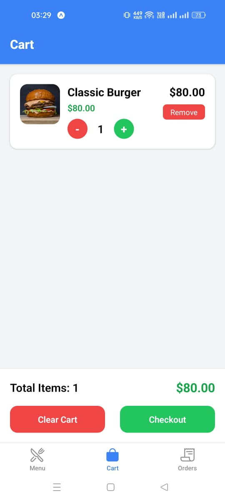
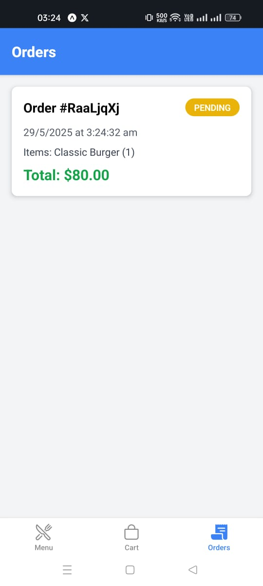
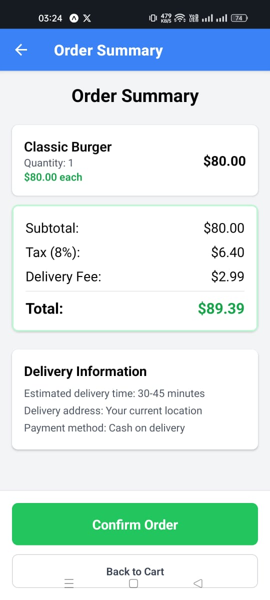

# Food Ordering App 🍔

A modern food ordering mobile application built with React Native and Expo, featuring real-time data synchronization with Firebase.


## 🚀 Getting Started

### Prerequisites

- Node.js (version 16 or higher)
- npm or yarn
- Expo CLI
- Expo Go app on your mobile device

### Installation

1. Clone the repository
   ```bash
   git clone https://github.com/prashsamosa/foodie
   cd foodie
   ```

2. Install dependencies
   ```bash
   npm install
   ```

3. Set up Firebase configuration
   - Create a `firebase.config.js` file in the root directory
   - Add your Firebase configuration (see Firebase Setup section)

4. Start the development server
   ```bash
   npx expo start
   ```

5. Scan the QR code with Expo Go app on your Android device

## 🔥 Firebase Setup

### 1. Create Firebase Project
- Go to [Firebase Console](https://console.firebase.google.com/)
- Create a new project named "food-ordering-app"
- Enable Firestore Database and Storage

### 2. Add Sample Data
Add the following document to your Firestore `menuItems` collection:

```javascript
// Document ID: burger1
{
  available: true,
  category: "Burgers",
  description: "double patty burger",
  image: "https://images.unsplash.com/photo-1568901346375-23c9450c58cd?q=80&w=1998&auto=format&fit=crop&ixlib=rb-4.1.0&ixid=M3wxMjA3fDB8MHxwaG90by1wYWdlfHx8fGVufDB8fHx8fA%3D%3D",
  name: "Classic Burger",
  price: 80
}
```

### 3. Firebase Configuration File
Create `firebase.config.js` in your project root:

```javascript
import { initializeApp } from 'firebase/app';
import { getFirestore } from 'firebase/firestore';
import { getStorage } from 'firebase/storage';

const firebaseConfig = {
  apiKey: "your-api-key",
  authDomain: "your-auth-domain",
  projectId: "your-project-id",
  storageBucket: "your-storage-bucket",
  messagingSenderId: "your-messaging-sender-id",
  appId: "your-app-id",
  measurementId: "your-measurement-id"
};

const app = initializeApp(firebaseConfig);
export const db = getFirestore(app);
export const storage = getStorage(app);
export default app;
```


## 🛠️ Tech Stack

- **Frontend**: React Native with Expo
- **Backend**: Firebase Firestore
- **Storage**: Firebase Storage
- **State Management**: React Context
- **Styling**: StyleSheet

## 📱 Installation Guide

### For Android Users:

1. Download **Expo Go** from Google Play Store
2. Open the app and scan the QR code displayed in your terminal
3. The app will load automatically

### For iOS Users:

1. Download **Expo Go** from App Store
2. Scan QR code with your camera or Expo Go app
3. Open in Expo Go when prompted


## Screenshots

<div style="display: flex; flex-direction: row; flex-wrap: wrap; gap: 10px;">
  

  

  

  
   
</div>


#
